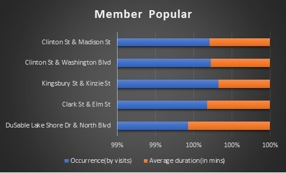
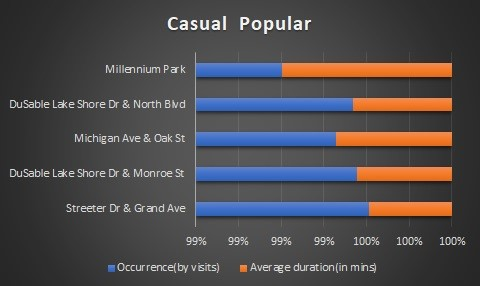
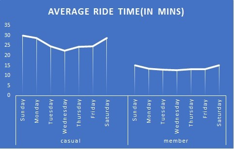
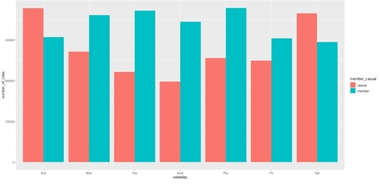
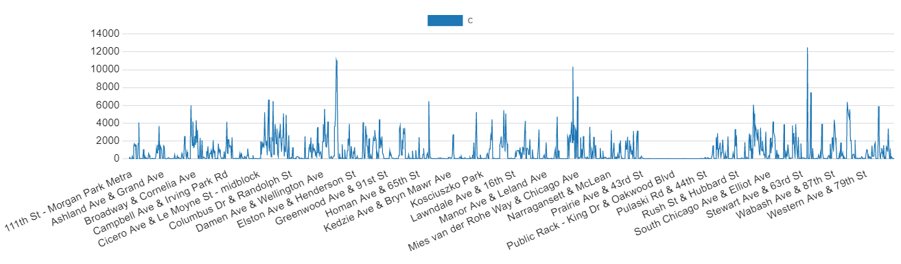
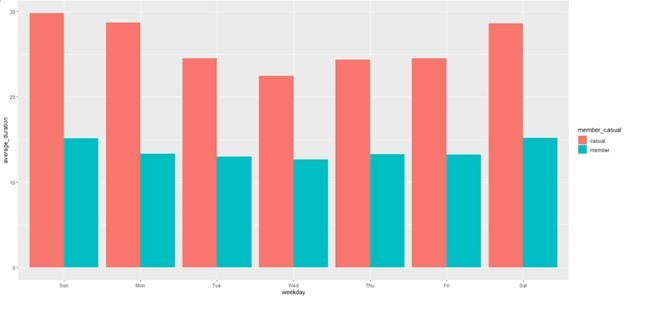

This is my Capstone project for Google Data Analytics certificate. The data used in this project is from the open source https://divvy-tripdata.s3.amazonaws.com/index.html provided by Google in the Coursera program. .csv files from 202205 to 202304 have been collated into the Cyclistic.csv as the raw data.

Skills Used: Excel, PostGre SQl and R (for both analysis and visualization)

The question I am trying to address here is to figure out how members and casual riders use the imaginary Cyclistic company’s services.

To address this, I first took a look at all the 12 .csv files in excel and confirmed that they all have the same column header. This led me to use R script to collate all the data into a single **Cyclistic.csv** file. 

Then I opened it in excel and ran some simple commands to separate date and time from the single started_at and ended_at datetime column. This is not necessary, but I wanted to explore my skills on excel.

As the dataset is huge, I immediately switched over to **PostGre SQL** for further preparation of the data. I ran a simple sql query to create a cyclistic table and imported all the data from Cyclistic.csv file.

As the pre-requisite,I ran a sql command to check if there are duplicates in ride_id column and found out there were none.

Then, I saw that there were no data for some columns like start_station_name, start_station_id, end_station_name and end_station_id. Hence, I filtered data with same start_lat, start_lng, end_lat and end_lng to try substituting the data. Unfortunately, there wasn’t a single column from which I can identify them, i.e, if one row didn’t have the station name, none of the rows in the table had it.

This led me to delete all those values and I took this decision because the data deleted was very small when compared with the whole dataset and we can’t work with incomplete data. Also, there wasn’t any team I could turn over for further enquiry.

Then, I ran some more queries to figure the duration of each ride in minutes and delete all the rows with irrelevant data. There were some rows with 0 minutes and one row with -127 and -129 minutes each. Time can’t be 0 or negative and hence they were deleted.

Then, I saved them with the name **cleaned_data.csv** and exported them.

Next comes the Analysis of the data. Upon running SQL queries, I figured out the **TOP 5** and the **LEAST 5 member’s and casual rider’s location**. This led to some interesting findings. **DuSable Lake Shore Dr & North Blvd** is the only location to appear on both the member and casual rider’s TOP 5 location with an impressive 4300 member visits and 6418 casual rider visits. Also, the average ride duration was 18.5 minutes for members and 29.9 minutes for casual riders here.

Similarly, there were **125 member locations and 95 casual rider’s location that were least visited** with just 1 visit in the whole dataset. Interestingly, there were **26 locations** that were **neither popular with members nor casual riders**. They can either be closed to concentrate funds better on other locations or if funds are in surplus, proper ads can be given to make these locations more visible. **Escpecially the Streeter Dr & Grand Ave region is popular among casual riders with high footfall, but short ride time and funds can be concentrated here.** 

Now, I moved on to R for further analysis. In R I created a dataframe called "**data**" and imported the cleaned_data.csv file in which I ran some scripts to find the mean, median, max and minimum duration of the ride_time.

The mean ride duration was 26.6 minutes for casual riders and 13.6 minutes for members. Also, the median was located at 16 minutes and 10 minutes for casual riders and members respectively. This proves that casual riders are higher in number and they use the company’s services more.

As the next step, I ordered the data by days of the week which led to one more interesting find. **We can infer that while members's duration is longer consistently across the weekdays, casual rider’s outperform members during the weekends.**.

Finally, what better mode to convey the findings if not by visualizing them. All the findings were **visualized using Excel charts, SQL chart visualization and R’s ggplot2**.

This brings us to the final part where we can confidently convey all my findings to the stakeholders with visualizations that are backed by data without any bias. Let me know how I did for my first project and ways in which I can improve. All my SQL codes and R codes are in separate files with their names.
